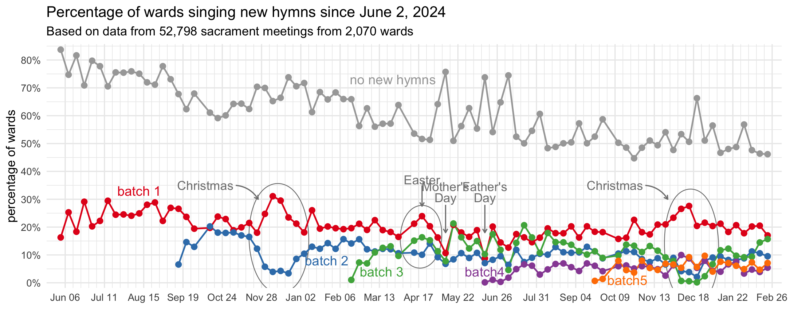
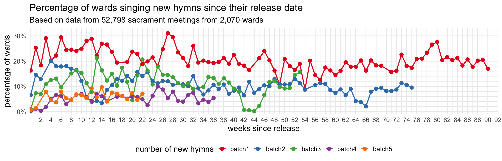
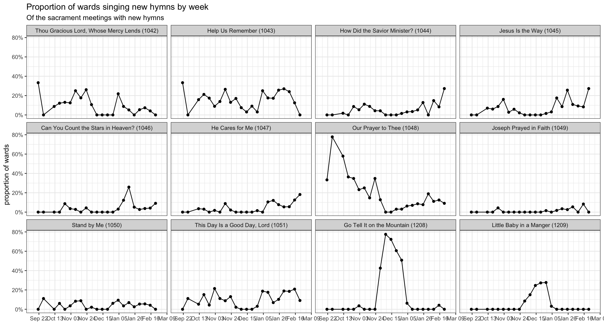

On September 18, 2025, the church [released](https://newsroom.churchofjesuschrist.org/article/hymn-written-by-president-nelson-included-in-latest-release) the fifth batch of new hymns, which features another African American spiritual, a hymn written by a Tongan saint, and lyrics written by President Nelson. In previous posts, I have covered in detail the [first](/posts/new_hymns_batch1), [second](/posts/new_hymns_batch2),  [third](/posts/new_hymns_batch3), and [fourth](/posts/new_hymns_batch4) batches of hymns and how they were incorporated into sacrament meetings. This page covers period since when the fifth batch came out and will update weekly as more data comes in. 

Currently I have data from 11,175 sacrament meetings from 1,215 wards since September 21, 2025. Here's how much data I have for each week so far, just so you have an idea of what I'm working with.


::: {.cell}
::: {.cell-output-display}

```{=html}
<div id="bbkmjxttzb" style="padding-left:0px;padding-right:0px;padding-top:10px;padding-bottom:10px;overflow-x:auto;overflow-y:auto;width:auto;height:auto;">
<style>#bbkmjxttzb table {
  font-family: system-ui, 'Segoe UI', Roboto, Helvetica, Arial, sans-serif, 'Apple Color Emoji', 'Segoe UI Emoji', 'Segoe UI Symbol', 'Noto Color Emoji';
  -webkit-font-smoothing: antialiased;
  -moz-osx-font-smoothing: grayscale;
}

#bbkmjxttzb thead, #bbkmjxttzb tbody, #bbkmjxttzb tfoot, #bbkmjxttzb tr, #bbkmjxttzb td, #bbkmjxttzb th {
  border-style: none;
}

#bbkmjxttzb p {
  margin: 0;
  padding: 0;
}

#bbkmjxttzb .gt_table {
  display: table;
  border-collapse: collapse;
  line-height: normal;
  margin-left: auto;
  margin-right: auto;
  color: #333333;
  font-size: 16px;
  font-weight: normal;
  font-style: normal;
  background-color: #FFFFFF;
  width: auto;
  border-top-style: solid;
  border-top-width: 2px;
  border-top-color: #A8A8A8;
  border-right-style: none;
  border-right-width: 2px;
  border-right-color: #D3D3D3;
  border-bottom-style: solid;
  border-bottom-width: 2px;
  border-bottom-color: #A8A8A8;
  border-left-style: none;
  border-left-width: 2px;
  border-left-color: #D3D3D3;
}

#bbkmjxttzb .gt_caption {
  padding-top: 4px;
  padding-bottom: 4px;
}

#bbkmjxttzb .gt_title {
  color: #333333;
  font-size: 125%;
  font-weight: initial;
  padding-top: 4px;
  padding-bottom: 4px;
  padding-left: 5px;
  padding-right: 5px;
  border-bottom-color: #FFFFFF;
  border-bottom-width: 0;
}

#bbkmjxttzb .gt_subtitle {
  color: #333333;
  font-size: 85%;
  font-weight: initial;
  padding-top: 3px;
  padding-bottom: 5px;
  padding-left: 5px;
  padding-right: 5px;
  border-top-color: #FFFFFF;
  border-top-width: 0;
}

#bbkmjxttzb .gt_heading {
  background-color: #FFFFFF;
  text-align: center;
  border-bottom-color: #FFFFFF;
  border-left-style: none;
  border-left-width: 1px;
  border-left-color: #D3D3D3;
  border-right-style: none;
  border-right-width: 1px;
  border-right-color: #D3D3D3;
}

#bbkmjxttzb .gt_bottom_border {
  border-bottom-style: solid;
  border-bottom-width: 2px;
  border-bottom-color: #D3D3D3;
}

#bbkmjxttzb .gt_col_headings {
  border-top-style: solid;
  border-top-width: 2px;
  border-top-color: #D3D3D3;
  border-bottom-style: solid;
  border-bottom-width: 2px;
  border-bottom-color: #D3D3D3;
  border-left-style: none;
  border-left-width: 1px;
  border-left-color: #D3D3D3;
  border-right-style: none;
  border-right-width: 1px;
  border-right-color: #D3D3D3;
}

#bbkmjxttzb .gt_col_heading {
  color: #333333;
  background-color: #FFFFFF;
  font-size: 100%;
  font-weight: normal;
  text-transform: inherit;
  border-left-style: none;
  border-left-width: 1px;
  border-left-color: #D3D3D3;
  border-right-style: none;
  border-right-width: 1px;
  border-right-color: #D3D3D3;
  vertical-align: bottom;
  padding-top: 5px;
  padding-bottom: 6px;
  padding-left: 5px;
  padding-right: 5px;
  overflow-x: hidden;
}

#bbkmjxttzb .gt_column_spanner_outer {
  color: #333333;
  background-color: #FFFFFF;
  font-size: 100%;
  font-weight: normal;
  text-transform: inherit;
  padding-top: 0;
  padding-bottom: 0;
  padding-left: 4px;
  padding-right: 4px;
}

#bbkmjxttzb .gt_column_spanner_outer:first-child {
  padding-left: 0;
}

#bbkmjxttzb .gt_column_spanner_outer:last-child {
  padding-right: 0;
}

#bbkmjxttzb .gt_column_spanner {
  border-bottom-style: solid;
  border-bottom-width: 2px;
  border-bottom-color: #D3D3D3;
  vertical-align: bottom;
  padding-top: 5px;
  padding-bottom: 5px;
  overflow-x: hidden;
  display: inline-block;
  width: 100%;
}

#bbkmjxttzb .gt_spanner_row {
  border-bottom-style: hidden;
}

#bbkmjxttzb .gt_group_heading {
  padding-top: 8px;
  padding-bottom: 8px;
  padding-left: 5px;
  padding-right: 5px;
  color: #333333;
  background-color: #FFFFFF;
  font-size: 100%;
  font-weight: initial;
  text-transform: inherit;
  border-top-style: solid;
  border-top-width: 2px;
  border-top-color: #D3D3D3;
  border-bottom-style: solid;
  border-bottom-width: 2px;
  border-bottom-color: #D3D3D3;
  border-left-style: none;
  border-left-width: 1px;
  border-left-color: #D3D3D3;
  border-right-style: none;
  border-right-width: 1px;
  border-right-color: #D3D3D3;
  vertical-align: middle;
  text-align: left;
}

#bbkmjxttzb .gt_empty_group_heading {
  padding: 0.5px;
  color: #333333;
  background-color: #FFFFFF;
  font-size: 100%;
  font-weight: initial;
  border-top-style: solid;
  border-top-width: 2px;
  border-top-color: #D3D3D3;
  border-bottom-style: solid;
  border-bottom-width: 2px;
  border-bottom-color: #D3D3D3;
  vertical-align: middle;
}

#bbkmjxttzb .gt_from_md > :first-child {
  margin-top: 0;
}

#bbkmjxttzb .gt_from_md > :last-child {
  margin-bottom: 0;
}

#bbkmjxttzb .gt_row {
  padding-top: 8px;
  padding-bottom: 8px;
  padding-left: 5px;
  padding-right: 5px;
  margin: 10px;
  border-top-style: solid;
  border-top-width: 1px;
  border-top-color: #D3D3D3;
  border-left-style: none;
  border-left-width: 1px;
  border-left-color: #D3D3D3;
  border-right-style: none;
  border-right-width: 1px;
  border-right-color: #D3D3D3;
  vertical-align: middle;
  overflow-x: hidden;
}

#bbkmjxttzb .gt_stub {
  color: #333333;
  background-color: #FFFFFF;
  font-size: 100%;
  font-weight: initial;
  text-transform: inherit;
  border-right-style: solid;
  border-right-width: 2px;
  border-right-color: #D3D3D3;
  padding-left: 5px;
  padding-right: 5px;
}

#bbkmjxttzb .gt_stub_row_group {
  color: #333333;
  background-color: #FFFFFF;
  font-size: 100%;
  font-weight: initial;
  text-transform: inherit;
  border-right-style: solid;
  border-right-width: 2px;
  border-right-color: #D3D3D3;
  padding-left: 5px;
  padding-right: 5px;
  vertical-align: top;
}

#bbkmjxttzb .gt_row_group_first td {
  border-top-width: 2px;
}

#bbkmjxttzb .gt_row_group_first th {
  border-top-width: 2px;
}

#bbkmjxttzb .gt_summary_row {
  color: #333333;
  background-color: #FFFFFF;
  text-transform: inherit;
  padding-top: 8px;
  padding-bottom: 8px;
  padding-left: 5px;
  padding-right: 5px;
}

#bbkmjxttzb .gt_first_summary_row {
  border-top-style: solid;
  border-top-color: #D3D3D3;
}

#bbkmjxttzb .gt_first_summary_row.thick {
  border-top-width: 2px;
}

#bbkmjxttzb .gt_last_summary_row {
  padding-top: 8px;
  padding-bottom: 8px;
  padding-left: 5px;
  padding-right: 5px;
  border-bottom-style: solid;
  border-bottom-width: 2px;
  border-bottom-color: #D3D3D3;
}

#bbkmjxttzb .gt_grand_summary_row {
  color: #333333;
  background-color: #FFFFFF;
  text-transform: inherit;
  padding-top: 8px;
  padding-bottom: 8px;
  padding-left: 5px;
  padding-right: 5px;
}

#bbkmjxttzb .gt_first_grand_summary_row {
  padding-top: 8px;
  padding-bottom: 8px;
  padding-left: 5px;
  padding-right: 5px;
  border-top-style: double;
  border-top-width: 6px;
  border-top-color: #D3D3D3;
}

#bbkmjxttzb .gt_last_grand_summary_row_top {
  padding-top: 8px;
  padding-bottom: 8px;
  padding-left: 5px;
  padding-right: 5px;
  border-bottom-style: double;
  border-bottom-width: 6px;
  border-bottom-color: #D3D3D3;
}

#bbkmjxttzb .gt_striped {
  background-color: rgba(128, 128, 128, 0.05);
}

#bbkmjxttzb .gt_table_body {
  border-top-style: solid;
  border-top-width: 2px;
  border-top-color: #D3D3D3;
  border-bottom-style: solid;
  border-bottom-width: 2px;
  border-bottom-color: #D3D3D3;
}

#bbkmjxttzb .gt_footnotes {
  color: #333333;
  background-color: #FFFFFF;
  border-bottom-style: none;
  border-bottom-width: 2px;
  border-bottom-color: #D3D3D3;
  border-left-style: none;
  border-left-width: 2px;
  border-left-color: #D3D3D3;
  border-right-style: none;
  border-right-width: 2px;
  border-right-color: #D3D3D3;
}

#bbkmjxttzb .gt_footnote {
  margin: 0px;
  font-size: 90%;
  padding-top: 4px;
  padding-bottom: 4px;
  padding-left: 5px;
  padding-right: 5px;
}

#bbkmjxttzb .gt_sourcenotes {
  color: #333333;
  background-color: #FFFFFF;
  border-bottom-style: none;
  border-bottom-width: 2px;
  border-bottom-color: #D3D3D3;
  border-left-style: none;
  border-left-width: 2px;
  border-left-color: #D3D3D3;
  border-right-style: none;
  border-right-width: 2px;
  border-right-color: #D3D3D3;
}

#bbkmjxttzb .gt_sourcenote {
  font-size: 90%;
  padding-top: 4px;
  padding-bottom: 4px;
  padding-left: 5px;
  padding-right: 5px;
}

#bbkmjxttzb .gt_left {
  text-align: left;
}

#bbkmjxttzb .gt_center {
  text-align: center;
}

#bbkmjxttzb .gt_right {
  text-align: right;
  font-variant-numeric: tabular-nums;
}

#bbkmjxttzb .gt_font_normal {
  font-weight: normal;
}

#bbkmjxttzb .gt_font_bold {
  font-weight: bold;
}

#bbkmjxttzb .gt_font_italic {
  font-style: italic;
}

#bbkmjxttzb .gt_super {
  font-size: 65%;
}

#bbkmjxttzb .gt_footnote_marks {
  font-size: 75%;
  vertical-align: 0.4em;
  position: initial;
}

#bbkmjxttzb .gt_asterisk {
  font-size: 100%;
  vertical-align: 0;
}

#bbkmjxttzb .gt_indent_1 {
  text-indent: 5px;
}

#bbkmjxttzb .gt_indent_2 {
  text-indent: 10px;
}

#bbkmjxttzb .gt_indent_3 {
  text-indent: 15px;
}

#bbkmjxttzb .gt_indent_4 {
  text-indent: 20px;
}

#bbkmjxttzb .gt_indent_5 {
  text-indent: 25px;
}

#bbkmjxttzb .katex-display {
  display: inline-flex !important;
  margin-bottom: 0.75em !important;
}

#bbkmjxttzb div.Reactable > div.rt-table > div.rt-thead > div.rt-tr.rt-tr-group-header > div.rt-th-group:after {
  height: 0px !important;
}
</style>
<table class="gt_table" data-quarto-disable-processing="false" data-quarto-bootstrap="false">
  <thead>
    <tr class="gt_heading">
      <td colspan="2" class="gt_heading gt_title gt_font_normal" style>Number of wards I have data from, by week</td>
    </tr>
    <tr class="gt_heading">
      <td colspan="2" class="gt_heading gt_subtitle gt_font_normal gt_bottom_border" style>Since September 21, 2025</td>
    </tr>
    <tr class="gt_col_headings">
      <th class="gt_col_heading gt_columns_bottom_border gt_left" rowspan="1" colspan="1" scope="col" id="date">date</th>
      <th class="gt_col_heading gt_columns_bottom_border gt_right" rowspan="1" colspan="1" scope="col" id="wards">wards</th>
    </tr>
  </thead>
  <tbody class="gt_table_body">
    <tr><td headers="date" class="gt_row gt_left">September 21</td>
<td headers="wards" class="gt_row gt_right">440</td></tr>
    <tr><td headers="date" class="gt_row gt_left">September 28</td>
<td headers="wards" class="gt_row gt_right">647</td></tr>
    <tr><td headers="date" class="gt_row gt_left">October 12</td>
<td headers="wards" class="gt_row gt_right">720</td></tr>
    <tr><td headers="date" class="gt_row gt_left">October 19</td>
<td headers="wards" class="gt_row gt_right">587</td></tr>
    <tr><td headers="date" class="gt_row gt_left">October 26</td>
<td headers="wards" class="gt_row gt_right">604</td></tr>
    <tr><td headers="date" class="gt_row gt_left">November 02</td>
<td headers="wards" class="gt_row gt_right">691</td></tr>
    <tr><td headers="date" class="gt_row gt_left">November 09</td>
<td headers="wards" class="gt_row gt_right">674</td></tr>
    <tr><td headers="date" class="gt_row gt_left">November 16</td>
<td headers="wards" class="gt_row gt_right">720</td></tr>
    <tr><td headers="date" class="gt_row gt_left">November 23</td>
<td headers="wards" class="gt_row gt_right">679</td></tr>
    <tr><td headers="date" class="gt_row gt_left">November 30</td>
<td headers="wards" class="gt_row gt_right">692</td></tr>
    <tr><td headers="date" class="gt_row gt_left">December 07</td>
<td headers="wards" class="gt_row gt_right">722</td></tr>
    <tr><td headers="date" class="gt_row gt_left">December 14</td>
<td headers="wards" class="gt_row gt_right">687</td></tr>
    <tr><td headers="date" class="gt_row gt_left">December 21</td>
<td headers="wards" class="gt_row gt_right">598</td></tr>
    <tr><td headers="date" class="gt_row gt_left">December 28</td>
<td headers="wards" class="gt_row gt_right">674</td></tr>
    <tr><td headers="date" class="gt_row gt_left">January 04</td>
<td headers="wards" class="gt_row gt_right">792</td></tr>
    <tr><td headers="date" class="gt_row gt_left">January 11</td>
<td headers="wards" class="gt_row gt_right">751</td></tr>
    <tr><td headers="date" class="gt_row gt_left">January 18</td>
<td headers="wards" class="gt_row gt_right">446</td></tr>
    <tr><td headers="date" class="gt_row gt_left">January 25</td>
<td headers="wards" class="gt_row gt_right">51</td></tr>
  </tbody>
  
  
</table>
</div>
```

:::
:::


## How many wards sang new hymns each week?

The following plot show what percentage of wards sang from each of the new batches of hymns, per week, since June 2024 when the new hymns started getting rolled out. I've included data from all batches just so you can compare them to each other.


::: {.cell .column-screen}
::: {.cell-output-display}
{width=1344}
:::
:::


The first two weeks of the fifth batch were pretty lukewarm. Very few wards sang those hymns. A few wards sang <hymn>Our Prayer to Thee (#1048)</hymn> on September 28, [the day after President Nelson died](/posts/president_nelsons_death), but otherwise, fifth-batch hymns were quite rare. 

There is a noticeable jump after General Conference though. More wards sang from the fifth batch on October 12 (7.9%) than even the best week of the fourth batch when it was the newest batch (August 24th: 6.8%). The bulk of this surge (about 62%) was, perhaps unsurprisingly because of President Nelson's recent passing, <hymn>Our Prayer to Thee (#1048)</hymn>. However, since then, I've seen all of the fifth batch hymns at least twice.

Since General Conference and through Christmastime, the fifth batch has held pretty constant at around 5%--10% of wards each week. Meanwhile, the other batches (notably the second and third) experience some slumps during Christmas time. 

A noteworthy landmark is that October 26 was the day where the most number of wards sang at least one new hymn: about 55%. We've seen a handful of weeks were right around half of wards sang new hymns, but that day was quite a bit more than others. We hit came close to this again on November 30, presumably as many wards started to sing the new Christmas hymns. In January 2026, we're seeing even more wards singing new hymns.

An interesting trend generally is that the first batch of hymns continues to be the most popular among any of the other ones. Even a year and a half after its release it still outperforms almost all of the more recent hymns. 


Here's another version of the same plot but instead of the actual dates, it's in terms of how many weeks since the batches came out. This version of the plot is useful to spot any parallel trends across the batches, especially in the first few weeks of their release.


::: {.cell .column-page}
::: {.cell-output-display}
{width=1344}
:::
:::


In this version of the plot, it's easier to compare batches. Thanks to that post--General Conference surge, the fifth batch was nearly as popular as the third batch for one week. Since then, it seems to be about as popular as the fourth batch was around this time. But it's still not super popular: it's as common to sing fifth batch hymns as it was to sing second batch hymns during Christmastime 2024.


## What hymns are most popular?

The following table shows the hymns from the fifth batch in order of how popular they are.  


::: {.cell}
::: {.cell-output-display}

```{=html}
<div id="lzienkrnyj" style="padding-left:0px;padding-right:0px;padding-top:10px;padding-bottom:10px;overflow-x:auto;overflow-y:auto;width:auto;height:auto;">
<style>#lzienkrnyj table {
  font-family: system-ui, 'Segoe UI', Roboto, Helvetica, Arial, sans-serif, 'Apple Color Emoji', 'Segoe UI Emoji', 'Segoe UI Symbol', 'Noto Color Emoji';
  -webkit-font-smoothing: antialiased;
  -moz-osx-font-smoothing: grayscale;
}

#lzienkrnyj thead, #lzienkrnyj tbody, #lzienkrnyj tfoot, #lzienkrnyj tr, #lzienkrnyj td, #lzienkrnyj th {
  border-style: none;
}

#lzienkrnyj p {
  margin: 0;
  padding: 0;
}

#lzienkrnyj .gt_table {
  display: table;
  border-collapse: collapse;
  line-height: normal;
  margin-left: auto;
  margin-right: auto;
  color: #333333;
  font-size: 16px;
  font-weight: normal;
  font-style: normal;
  background-color: #FFFFFF;
  width: auto;
  border-top-style: solid;
  border-top-width: 2px;
  border-top-color: #A8A8A8;
  border-right-style: none;
  border-right-width: 2px;
  border-right-color: #D3D3D3;
  border-bottom-style: solid;
  border-bottom-width: 2px;
  border-bottom-color: #A8A8A8;
  border-left-style: none;
  border-left-width: 2px;
  border-left-color: #D3D3D3;
}

#lzienkrnyj .gt_caption {
  padding-top: 4px;
  padding-bottom: 4px;
}

#lzienkrnyj .gt_title {
  color: #333333;
  font-size: 125%;
  font-weight: initial;
  padding-top: 4px;
  padding-bottom: 4px;
  padding-left: 5px;
  padding-right: 5px;
  border-bottom-color: #FFFFFF;
  border-bottom-width: 0;
}

#lzienkrnyj .gt_subtitle {
  color: #333333;
  font-size: 85%;
  font-weight: initial;
  padding-top: 3px;
  padding-bottom: 5px;
  padding-left: 5px;
  padding-right: 5px;
  border-top-color: #FFFFFF;
  border-top-width: 0;
}

#lzienkrnyj .gt_heading {
  background-color: #FFFFFF;
  text-align: center;
  border-bottom-color: #FFFFFF;
  border-left-style: none;
  border-left-width: 1px;
  border-left-color: #D3D3D3;
  border-right-style: none;
  border-right-width: 1px;
  border-right-color: #D3D3D3;
}

#lzienkrnyj .gt_bottom_border {
  border-bottom-style: solid;
  border-bottom-width: 2px;
  border-bottom-color: #D3D3D3;
}

#lzienkrnyj .gt_col_headings {
  border-top-style: solid;
  border-top-width: 2px;
  border-top-color: #D3D3D3;
  border-bottom-style: solid;
  border-bottom-width: 2px;
  border-bottom-color: #D3D3D3;
  border-left-style: none;
  border-left-width: 1px;
  border-left-color: #D3D3D3;
  border-right-style: none;
  border-right-width: 1px;
  border-right-color: #D3D3D3;
}

#lzienkrnyj .gt_col_heading {
  color: #333333;
  background-color: #FFFFFF;
  font-size: 100%;
  font-weight: normal;
  text-transform: inherit;
  border-left-style: none;
  border-left-width: 1px;
  border-left-color: #D3D3D3;
  border-right-style: none;
  border-right-width: 1px;
  border-right-color: #D3D3D3;
  vertical-align: bottom;
  padding-top: 5px;
  padding-bottom: 6px;
  padding-left: 5px;
  padding-right: 5px;
  overflow-x: hidden;
}

#lzienkrnyj .gt_column_spanner_outer {
  color: #333333;
  background-color: #FFFFFF;
  font-size: 100%;
  font-weight: normal;
  text-transform: inherit;
  padding-top: 0;
  padding-bottom: 0;
  padding-left: 4px;
  padding-right: 4px;
}

#lzienkrnyj .gt_column_spanner_outer:first-child {
  padding-left: 0;
}

#lzienkrnyj .gt_column_spanner_outer:last-child {
  padding-right: 0;
}

#lzienkrnyj .gt_column_spanner {
  border-bottom-style: solid;
  border-bottom-width: 2px;
  border-bottom-color: #D3D3D3;
  vertical-align: bottom;
  padding-top: 5px;
  padding-bottom: 5px;
  overflow-x: hidden;
  display: inline-block;
  width: 100%;
}

#lzienkrnyj .gt_spanner_row {
  border-bottom-style: hidden;
}

#lzienkrnyj .gt_group_heading {
  padding-top: 8px;
  padding-bottom: 8px;
  padding-left: 5px;
  padding-right: 5px;
  color: #333333;
  background-color: #FFFFFF;
  font-size: 100%;
  font-weight: initial;
  text-transform: inherit;
  border-top-style: solid;
  border-top-width: 2px;
  border-top-color: #D3D3D3;
  border-bottom-style: solid;
  border-bottom-width: 2px;
  border-bottom-color: #D3D3D3;
  border-left-style: none;
  border-left-width: 1px;
  border-left-color: #D3D3D3;
  border-right-style: none;
  border-right-width: 1px;
  border-right-color: #D3D3D3;
  vertical-align: middle;
  text-align: left;
}

#lzienkrnyj .gt_empty_group_heading {
  padding: 0.5px;
  color: #333333;
  background-color: #FFFFFF;
  font-size: 100%;
  font-weight: initial;
  border-top-style: solid;
  border-top-width: 2px;
  border-top-color: #D3D3D3;
  border-bottom-style: solid;
  border-bottom-width: 2px;
  border-bottom-color: #D3D3D3;
  vertical-align: middle;
}

#lzienkrnyj .gt_from_md > :first-child {
  margin-top: 0;
}

#lzienkrnyj .gt_from_md > :last-child {
  margin-bottom: 0;
}

#lzienkrnyj .gt_row {
  padding-top: 8px;
  padding-bottom: 8px;
  padding-left: 5px;
  padding-right: 5px;
  margin: 10px;
  border-top-style: solid;
  border-top-width: 1px;
  border-top-color: #D3D3D3;
  border-left-style: none;
  border-left-width: 1px;
  border-left-color: #D3D3D3;
  border-right-style: none;
  border-right-width: 1px;
  border-right-color: #D3D3D3;
  vertical-align: middle;
  overflow-x: hidden;
}

#lzienkrnyj .gt_stub {
  color: #333333;
  background-color: #FFFFFF;
  font-size: 100%;
  font-weight: initial;
  text-transform: inherit;
  border-right-style: solid;
  border-right-width: 2px;
  border-right-color: #D3D3D3;
  padding-left: 5px;
  padding-right: 5px;
}

#lzienkrnyj .gt_stub_row_group {
  color: #333333;
  background-color: #FFFFFF;
  font-size: 100%;
  font-weight: initial;
  text-transform: inherit;
  border-right-style: solid;
  border-right-width: 2px;
  border-right-color: #D3D3D3;
  padding-left: 5px;
  padding-right: 5px;
  vertical-align: top;
}

#lzienkrnyj .gt_row_group_first td {
  border-top-width: 2px;
}

#lzienkrnyj .gt_row_group_first th {
  border-top-width: 2px;
}

#lzienkrnyj .gt_summary_row {
  color: #333333;
  background-color: #FFFFFF;
  text-transform: inherit;
  padding-top: 8px;
  padding-bottom: 8px;
  padding-left: 5px;
  padding-right: 5px;
}

#lzienkrnyj .gt_first_summary_row {
  border-top-style: solid;
  border-top-color: #D3D3D3;
}

#lzienkrnyj .gt_first_summary_row.thick {
  border-top-width: 2px;
}

#lzienkrnyj .gt_last_summary_row {
  padding-top: 8px;
  padding-bottom: 8px;
  padding-left: 5px;
  padding-right: 5px;
  border-bottom-style: solid;
  border-bottom-width: 2px;
  border-bottom-color: #D3D3D3;
}

#lzienkrnyj .gt_grand_summary_row {
  color: #333333;
  background-color: #FFFFFF;
  text-transform: inherit;
  padding-top: 8px;
  padding-bottom: 8px;
  padding-left: 5px;
  padding-right: 5px;
}

#lzienkrnyj .gt_first_grand_summary_row {
  padding-top: 8px;
  padding-bottom: 8px;
  padding-left: 5px;
  padding-right: 5px;
  border-top-style: double;
  border-top-width: 6px;
  border-top-color: #D3D3D3;
}

#lzienkrnyj .gt_last_grand_summary_row_top {
  padding-top: 8px;
  padding-bottom: 8px;
  padding-left: 5px;
  padding-right: 5px;
  border-bottom-style: double;
  border-bottom-width: 6px;
  border-bottom-color: #D3D3D3;
}

#lzienkrnyj .gt_striped {
  background-color: rgba(128, 128, 128, 0.05);
}

#lzienkrnyj .gt_table_body {
  border-top-style: solid;
  border-top-width: 2px;
  border-top-color: #D3D3D3;
  border-bottom-style: solid;
  border-bottom-width: 2px;
  border-bottom-color: #D3D3D3;
}

#lzienkrnyj .gt_footnotes {
  color: #333333;
  background-color: #FFFFFF;
  border-bottom-style: none;
  border-bottom-width: 2px;
  border-bottom-color: #D3D3D3;
  border-left-style: none;
  border-left-width: 2px;
  border-left-color: #D3D3D3;
  border-right-style: none;
  border-right-width: 2px;
  border-right-color: #D3D3D3;
}

#lzienkrnyj .gt_footnote {
  margin: 0px;
  font-size: 90%;
  padding-top: 4px;
  padding-bottom: 4px;
  padding-left: 5px;
  padding-right: 5px;
}

#lzienkrnyj .gt_sourcenotes {
  color: #333333;
  background-color: #FFFFFF;
  border-bottom-style: none;
  border-bottom-width: 2px;
  border-bottom-color: #D3D3D3;
  border-left-style: none;
  border-left-width: 2px;
  border-left-color: #D3D3D3;
  border-right-style: none;
  border-right-width: 2px;
  border-right-color: #D3D3D3;
}

#lzienkrnyj .gt_sourcenote {
  font-size: 90%;
  padding-top: 4px;
  padding-bottom: 4px;
  padding-left: 5px;
  padding-right: 5px;
}

#lzienkrnyj .gt_left {
  text-align: left;
}

#lzienkrnyj .gt_center {
  text-align: center;
}

#lzienkrnyj .gt_right {
  text-align: right;
  font-variant-numeric: tabular-nums;
}

#lzienkrnyj .gt_font_normal {
  font-weight: normal;
}

#lzienkrnyj .gt_font_bold {
  font-weight: bold;
}

#lzienkrnyj .gt_font_italic {
  font-style: italic;
}

#lzienkrnyj .gt_super {
  font-size: 65%;
}

#lzienkrnyj .gt_footnote_marks {
  font-size: 75%;
  vertical-align: 0.4em;
  position: initial;
}

#lzienkrnyj .gt_asterisk {
  font-size: 100%;
  vertical-align: 0;
}

#lzienkrnyj .gt_indent_1 {
  text-indent: 5px;
}

#lzienkrnyj .gt_indent_2 {
  text-indent: 10px;
}

#lzienkrnyj .gt_indent_3 {
  text-indent: 15px;
}

#lzienkrnyj .gt_indent_4 {
  text-indent: 20px;
}

#lzienkrnyj .gt_indent_5 {
  text-indent: 25px;
}

#lzienkrnyj .katex-display {
  display: inline-flex !important;
  margin-bottom: 0.75em !important;
}

#lzienkrnyj div.Reactable > div.rt-table > div.rt-thead > div.rt-tr.rt-tr-group-header > div.rt-th-group:after {
  height: 0px !important;
}
</style>
<table class="gt_table" data-quarto-disable-processing="false" data-quarto-bootstrap="false">
  <thead>
    <tr class="gt_heading">
      <td colspan="2" class="gt_heading gt_title gt_font_normal" style>Approximate percentage of wards new hymns have been sung in</td>
    </tr>
    <tr class="gt_heading">
      <td colspan="2" class="gt_heading gt_subtitle gt_font_normal gt_bottom_border" style>Since June 15, 2025</td>
    </tr>
    <tr class="gt_col_headings">
      <th class="gt_col_heading gt_columns_bottom_border gt_left" rowspan="1" colspan="1" scope="col" id="Hymn">Hymn</th>
      <th class="gt_col_heading gt_columns_bottom_border gt_right" rowspan="1" colspan="1" scope="col" id="percent-of-wards">percent of wards</th>
    </tr>
  </thead>
  <tbody class="gt_table_body">
    <tr><td headers="Hymn" class="gt_row gt_left">Go Tell It on the Mountain (1208)</td>
<td headers="percent of wards" class="gt_row gt_right">11.2%</td></tr>
    <tr><td headers="Hymn" class="gt_row gt_left">Our Prayer to Thee (1048)</td>
<td headers="percent of wards" class="gt_row gt_right">8.6%</td></tr>
    <tr><td headers="Hymn" class="gt_row gt_left">Help Us Remember (1043)</td>
<td headers="percent of wards" class="gt_row gt_right">7.9%</td></tr>
    <tr><td headers="Hymn" class="gt_row gt_left">Jesus Is the Way (1045)</td>
<td headers="percent of wards" class="gt_row gt_right">4.6%</td></tr>
    <tr><td headers="Hymn" class="gt_row gt_left">Thou Gracious Lord, Whose Mercy Lends (1042)</td>
<td headers="percent of wards" class="gt_row gt_right">4.6%</td></tr>
    <tr><td headers="Hymn" class="gt_row gt_left">This Day Is a Good Day, Lord (1051)</td>
<td headers="percent of wards" class="gt_row gt_right">3.9%</td></tr>
    <tr><td headers="Hymn" class="gt_row gt_left">Little Baby in a Manger (1209)</td>
<td headers="percent of wards" class="gt_row gt_right">3.9%</td></tr>
    <tr><td headers="Hymn" class="gt_row gt_left">Can You Count the Stars in Heaven? (1046)</td>
<td headers="percent of wards" class="gt_row gt_right">2.0%</td></tr>
    <tr><td headers="Hymn" class="gt_row gt_left">Stand by Me (1050)</td>
<td headers="percent of wards" class="gt_row gt_right">1.8%</td></tr>
    <tr><td headers="Hymn" class="gt_row gt_left">How Did the Savior Minister? (1044)</td>
<td headers="percent of wards" class="gt_row gt_right">1.6%</td></tr>
    <tr><td headers="Hymn" class="gt_row gt_left">He Cares for Me (1047)</td>
<td headers="percent of wards" class="gt_row gt_right">1.6%</td></tr>
    <tr><td headers="Hymn" class="gt_row gt_left">Joseph Prayed in Faith (1049)</td>
<td headers="percent of wards" class="gt_row gt_right">0.3%</td></tr>
  </tbody>
  
  
</table>
</div>
```

:::
:::


The most popular hymn during this batch is <hymn>Go Tell It on the Mountain (#1208)</hymn>. This is almost certainly because it is a Christmas hymn and we recently celebrated Christmas. Since it is a Christmas hymn, we likely won't see it sung very often until the end of November 2026, which means other hymns will get a chance to be sung. We'll have to wait a full 52 weeks to see how <hymn>Go Tell It on the Mountain (#1208)</hymn> compares to the other hymns in this batch, but I suspect it might lose its place as the most popular hymn in this batch. 

A distant second is <hymn>Our Prayer to Thee (#1048)</hymn>. There may be a few reasons for this. One, I think it's objectively a good hymn. Two, it uses a tune that is well known in the Christian world. In fact, we used this tune in the previous hymnal for <hymn>O Home Beloved (#337)</hymn>. But in the 85,000 sacrament meetings I have data for I have *not once* seen that hymn being sung. So I'm glad they're repurposing it for this hymn. And finally, President Russell M. Nelson wrote the lyrics to the hymn. Now, it might be a coincidence, but he passed away just after this hymn was released and I can't help but wonder whether it's as popular as it is because a fair number of wards sang it soon after that presumably in his honor. We'll never know. 

The next one, <hymn>Help Us Remember (#1043)</hymn> is the only sacrament hymn in this batch, and [sacrament hymns tend to be sung more](/posts/sacrament).

The rest of the hymns trail behind. I personally am a fan of <hymn>This Day Is a Good Day, Lord (#1051)</hymn>, so I'm goad to see it as high as it is on this list. It is interesting that while <hymn>Go Tell It on the Mountain (#1208)</hymn> was popular during Christmas, <hymn>Little Baby in a Manger (#1209)</hymn> was not so much. Familiarity and prior exposure to the hymn likely is an influence, but also I think maybe some wards are uncomfortable with that style of melody in congregational singing still. 

There is a clear least popular hymn, <hymn>Joseph Prayed in Faith (#1049)</hymn>. While I have seen each of the other hymns sung at least a dozen times, this one I've only seen twice. My guess is that it'll become more popular in the spring when people tend to sing Joseph Smith--related hymns. So, I don't think it's any worse of a hymn, but it's just not the time of year for it.


## What hymns are most popular each week?

This plot shows how popular each hymn is each week. Out of all the fifth batch hymns sing in a given week, what percentage of them were <hymn>Our Prayer to Thee (#1048)</hymn>, for example?


::: {.cell .column-page}
::: {.cell-output-display}
{width=1248}
:::
:::


For some weeks, particularly in the beginning, the data is sparse, so it's important to to put too much weight into the percentages. But it is clear that <hymn>Our Prayer to Thee (#1048)</hymn> was the most popular in the batch when these first came out, but it has been waning since then. The other super clear pattern is the spike in the two Christmas hymns, <hymn>Go Tell It on the Mountain (#1208)</hymn> and <hymn>Little Baby in a Manger (#1209)</hymn>. There aren't too many other super clear patterns other than those three, although there does seem to be a trend for some hymns to be more popular in the past few weeks than earlier in this batch's time. 


## When during meetings are these hymns sung?

This table shows when during sacrament meetings these hymns have been sung. 


::: {.cell}
::: {.cell-output-display}

```{=html}
<div id="llkwhjdtvo" style="padding-left:0px;padding-right:0px;padding-top:10px;padding-bottom:10px;overflow-x:auto;overflow-y:auto;width:auto;height:auto;">
<style>#llkwhjdtvo table {
  font-family: system-ui, 'Segoe UI', Roboto, Helvetica, Arial, sans-serif, 'Apple Color Emoji', 'Segoe UI Emoji', 'Segoe UI Symbol', 'Noto Color Emoji';
  -webkit-font-smoothing: antialiased;
  -moz-osx-font-smoothing: grayscale;
}

#llkwhjdtvo thead, #llkwhjdtvo tbody, #llkwhjdtvo tfoot, #llkwhjdtvo tr, #llkwhjdtvo td, #llkwhjdtvo th {
  border-style: none;
}

#llkwhjdtvo p {
  margin: 0;
  padding: 0;
}

#llkwhjdtvo .gt_table {
  display: table;
  border-collapse: collapse;
  line-height: normal;
  margin-left: auto;
  margin-right: auto;
  color: #333333;
  font-size: 16px;
  font-weight: normal;
  font-style: normal;
  background-color: #FFFFFF;
  width: auto;
  border-top-style: solid;
  border-top-width: 2px;
  border-top-color: #A8A8A8;
  border-right-style: none;
  border-right-width: 2px;
  border-right-color: #D3D3D3;
  border-bottom-style: solid;
  border-bottom-width: 2px;
  border-bottom-color: #A8A8A8;
  border-left-style: none;
  border-left-width: 2px;
  border-left-color: #D3D3D3;
}

#llkwhjdtvo .gt_caption {
  padding-top: 4px;
  padding-bottom: 4px;
}

#llkwhjdtvo .gt_title {
  color: #333333;
  font-size: 125%;
  font-weight: initial;
  padding-top: 4px;
  padding-bottom: 4px;
  padding-left: 5px;
  padding-right: 5px;
  border-bottom-color: #FFFFFF;
  border-bottom-width: 0;
}

#llkwhjdtvo .gt_subtitle {
  color: #333333;
  font-size: 85%;
  font-weight: initial;
  padding-top: 3px;
  padding-bottom: 5px;
  padding-left: 5px;
  padding-right: 5px;
  border-top-color: #FFFFFF;
  border-top-width: 0;
}

#llkwhjdtvo .gt_heading {
  background-color: #FFFFFF;
  text-align: center;
  border-bottom-color: #FFFFFF;
  border-left-style: none;
  border-left-width: 1px;
  border-left-color: #D3D3D3;
  border-right-style: none;
  border-right-width: 1px;
  border-right-color: #D3D3D3;
}

#llkwhjdtvo .gt_bottom_border {
  border-bottom-style: solid;
  border-bottom-width: 2px;
  border-bottom-color: #D3D3D3;
}

#llkwhjdtvo .gt_col_headings {
  border-top-style: solid;
  border-top-width: 2px;
  border-top-color: #D3D3D3;
  border-bottom-style: solid;
  border-bottom-width: 2px;
  border-bottom-color: #D3D3D3;
  border-left-style: none;
  border-left-width: 1px;
  border-left-color: #D3D3D3;
  border-right-style: none;
  border-right-width: 1px;
  border-right-color: #D3D3D3;
}

#llkwhjdtvo .gt_col_heading {
  color: #333333;
  background-color: #FFFFFF;
  font-size: 100%;
  font-weight: normal;
  text-transform: inherit;
  border-left-style: none;
  border-left-width: 1px;
  border-left-color: #D3D3D3;
  border-right-style: none;
  border-right-width: 1px;
  border-right-color: #D3D3D3;
  vertical-align: bottom;
  padding-top: 5px;
  padding-bottom: 6px;
  padding-left: 5px;
  padding-right: 5px;
  overflow-x: hidden;
}

#llkwhjdtvo .gt_column_spanner_outer {
  color: #333333;
  background-color: #FFFFFF;
  font-size: 100%;
  font-weight: normal;
  text-transform: inherit;
  padding-top: 0;
  padding-bottom: 0;
  padding-left: 4px;
  padding-right: 4px;
}

#llkwhjdtvo .gt_column_spanner_outer:first-child {
  padding-left: 0;
}

#llkwhjdtvo .gt_column_spanner_outer:last-child {
  padding-right: 0;
}

#llkwhjdtvo .gt_column_spanner {
  border-bottom-style: solid;
  border-bottom-width: 2px;
  border-bottom-color: #D3D3D3;
  vertical-align: bottom;
  padding-top: 5px;
  padding-bottom: 5px;
  overflow-x: hidden;
  display: inline-block;
  width: 100%;
}

#llkwhjdtvo .gt_spanner_row {
  border-bottom-style: hidden;
}

#llkwhjdtvo .gt_group_heading {
  padding-top: 8px;
  padding-bottom: 8px;
  padding-left: 5px;
  padding-right: 5px;
  color: #333333;
  background-color: #FFFFFF;
  font-size: 100%;
  font-weight: initial;
  text-transform: inherit;
  border-top-style: solid;
  border-top-width: 2px;
  border-top-color: #D3D3D3;
  border-bottom-style: solid;
  border-bottom-width: 2px;
  border-bottom-color: #D3D3D3;
  border-left-style: none;
  border-left-width: 1px;
  border-left-color: #D3D3D3;
  border-right-style: none;
  border-right-width: 1px;
  border-right-color: #D3D3D3;
  vertical-align: middle;
  text-align: left;
}

#llkwhjdtvo .gt_empty_group_heading {
  padding: 0.5px;
  color: #333333;
  background-color: #FFFFFF;
  font-size: 100%;
  font-weight: initial;
  border-top-style: solid;
  border-top-width: 2px;
  border-top-color: #D3D3D3;
  border-bottom-style: solid;
  border-bottom-width: 2px;
  border-bottom-color: #D3D3D3;
  vertical-align: middle;
}

#llkwhjdtvo .gt_from_md > :first-child {
  margin-top: 0;
}

#llkwhjdtvo .gt_from_md > :last-child {
  margin-bottom: 0;
}

#llkwhjdtvo .gt_row {
  padding-top: 8px;
  padding-bottom: 8px;
  padding-left: 5px;
  padding-right: 5px;
  margin: 10px;
  border-top-style: solid;
  border-top-width: 1px;
  border-top-color: #D3D3D3;
  border-left-style: none;
  border-left-width: 1px;
  border-left-color: #D3D3D3;
  border-right-style: none;
  border-right-width: 1px;
  border-right-color: #D3D3D3;
  vertical-align: middle;
  overflow-x: hidden;
}

#llkwhjdtvo .gt_stub {
  color: #333333;
  background-color: #FFFFFF;
  font-size: 100%;
  font-weight: initial;
  text-transform: inherit;
  border-right-style: solid;
  border-right-width: 2px;
  border-right-color: #D3D3D3;
  padding-left: 5px;
  padding-right: 5px;
}

#llkwhjdtvo .gt_stub_row_group {
  color: #333333;
  background-color: #FFFFFF;
  font-size: 100%;
  font-weight: initial;
  text-transform: inherit;
  border-right-style: solid;
  border-right-width: 2px;
  border-right-color: #D3D3D3;
  padding-left: 5px;
  padding-right: 5px;
  vertical-align: top;
}

#llkwhjdtvo .gt_row_group_first td {
  border-top-width: 2px;
}

#llkwhjdtvo .gt_row_group_first th {
  border-top-width: 2px;
}

#llkwhjdtvo .gt_summary_row {
  color: #333333;
  background-color: #FFFFFF;
  text-transform: inherit;
  padding-top: 8px;
  padding-bottom: 8px;
  padding-left: 5px;
  padding-right: 5px;
}

#llkwhjdtvo .gt_first_summary_row {
  border-top-style: solid;
  border-top-color: #D3D3D3;
}

#llkwhjdtvo .gt_first_summary_row.thick {
  border-top-width: 2px;
}

#llkwhjdtvo .gt_last_summary_row {
  padding-top: 8px;
  padding-bottom: 8px;
  padding-left: 5px;
  padding-right: 5px;
  border-bottom-style: solid;
  border-bottom-width: 2px;
  border-bottom-color: #D3D3D3;
}

#llkwhjdtvo .gt_grand_summary_row {
  color: #333333;
  background-color: #FFFFFF;
  text-transform: inherit;
  padding-top: 8px;
  padding-bottom: 8px;
  padding-left: 5px;
  padding-right: 5px;
}

#llkwhjdtvo .gt_first_grand_summary_row {
  padding-top: 8px;
  padding-bottom: 8px;
  padding-left: 5px;
  padding-right: 5px;
  border-top-style: double;
  border-top-width: 6px;
  border-top-color: #D3D3D3;
}

#llkwhjdtvo .gt_last_grand_summary_row_top {
  padding-top: 8px;
  padding-bottom: 8px;
  padding-left: 5px;
  padding-right: 5px;
  border-bottom-style: double;
  border-bottom-width: 6px;
  border-bottom-color: #D3D3D3;
}

#llkwhjdtvo .gt_striped {
  background-color: rgba(128, 128, 128, 0.05);
}

#llkwhjdtvo .gt_table_body {
  border-top-style: solid;
  border-top-width: 2px;
  border-top-color: #D3D3D3;
  border-bottom-style: solid;
  border-bottom-width: 2px;
  border-bottom-color: #D3D3D3;
}

#llkwhjdtvo .gt_footnotes {
  color: #333333;
  background-color: #FFFFFF;
  border-bottom-style: none;
  border-bottom-width: 2px;
  border-bottom-color: #D3D3D3;
  border-left-style: none;
  border-left-width: 2px;
  border-left-color: #D3D3D3;
  border-right-style: none;
  border-right-width: 2px;
  border-right-color: #D3D3D3;
}

#llkwhjdtvo .gt_footnote {
  margin: 0px;
  font-size: 90%;
  padding-top: 4px;
  padding-bottom: 4px;
  padding-left: 5px;
  padding-right: 5px;
}

#llkwhjdtvo .gt_sourcenotes {
  color: #333333;
  background-color: #FFFFFF;
  border-bottom-style: none;
  border-bottom-width: 2px;
  border-bottom-color: #D3D3D3;
  border-left-style: none;
  border-left-width: 2px;
  border-left-color: #D3D3D3;
  border-right-style: none;
  border-right-width: 2px;
  border-right-color: #D3D3D3;
}

#llkwhjdtvo .gt_sourcenote {
  font-size: 90%;
  padding-top: 4px;
  padding-bottom: 4px;
  padding-left: 5px;
  padding-right: 5px;
}

#llkwhjdtvo .gt_left {
  text-align: left;
}

#llkwhjdtvo .gt_center {
  text-align: center;
}

#llkwhjdtvo .gt_right {
  text-align: right;
  font-variant-numeric: tabular-nums;
}

#llkwhjdtvo .gt_font_normal {
  font-weight: normal;
}

#llkwhjdtvo .gt_font_bold {
  font-weight: bold;
}

#llkwhjdtvo .gt_font_italic {
  font-style: italic;
}

#llkwhjdtvo .gt_super {
  font-size: 65%;
}

#llkwhjdtvo .gt_footnote_marks {
  font-size: 75%;
  vertical-align: 0.4em;
  position: initial;
}

#llkwhjdtvo .gt_asterisk {
  font-size: 100%;
  vertical-align: 0;
}

#llkwhjdtvo .gt_indent_1 {
  text-indent: 5px;
}

#llkwhjdtvo .gt_indent_2 {
  text-indent: 10px;
}

#llkwhjdtvo .gt_indent_3 {
  text-indent: 15px;
}

#llkwhjdtvo .gt_indent_4 {
  text-indent: 20px;
}

#llkwhjdtvo .gt_indent_5 {
  text-indent: 25px;
}

#llkwhjdtvo .katex-display {
  display: inline-flex !important;
  margin-bottom: 0.75em !important;
}

#llkwhjdtvo div.Reactable > div.rt-table > div.rt-thead > div.rt-tr.rt-tr-group-header > div.rt-th-group:after {
  height: 0px !important;
}
</style>
<table class="gt_table" style="table-layout:fixed;" data-quarto-disable-processing="false" data-quarto-bootstrap="false">
  <colgroup>
    <col/>
    <col style="width:100px;"/>
    <col style="width:100px;"/>
    <col style="width:100px;"/>
    <col style="width:100px;"/>
  </colgroup>
  <thead>
    <tr class="gt_heading">
      <td colspan="5" class="gt_heading gt_title gt_font_normal" style>When were new hymns sung in sacrament meeting?</td>
    </tr>
    <tr class="gt_heading">
      <td colspan="5" class="gt_heading gt_subtitle gt_font_normal gt_bottom_border" style>Since September 21, 2025</td>
    </tr>
    <tr class="gt_col_headings">
      <th class="gt_col_heading gt_columns_bottom_border gt_left" rowspan="1" colspan="1" scope="col" id="New-Hymn">New Hymn</th>
      <th class="gt_col_heading gt_columns_bottom_border gt_left" rowspan="1" colspan="1" scope="col" id="Opening">Opening</th>
      <th class="gt_col_heading gt_columns_bottom_border gt_left" rowspan="1" colspan="1" scope="col" id="Sacrament">Sacrament</th>
      <th class="gt_col_heading gt_columns_bottom_border gt_left" rowspan="1" colspan="1" scope="col" id="Intermediate">Intermediate</th>
      <th class="gt_col_heading gt_columns_bottom_border gt_left" rowspan="1" colspan="1" scope="col" id="Closing">Closing</th>
    </tr>
  </thead>
  <tbody class="gt_table_body">
    <tr><td headers="New Hymn" class="gt_row gt_left">Thou Gracious Lord, Whose Mercy Lends (1042)</td>
<td headers="Opening" class="gt_row gt_left"><div style='flex-grow:1;margin-left:8px;background:#e1e1e1;'><div style='background:#4F2B47;width:42%;height:20px;display:flex;align-items:center;justify-content:flex-start;position:relative;'><span style='color:#FFFFFF;position:absolute;left:0px;margin-left:5px;font-weight:bold;font-size:14px;'>42%</span></div></div></td>
<td headers="Sacrament" class="gt_row gt_left"><div style='flex-grow:1;margin-left:8px;background:#e1e1e1;'><div style='background:#4F2B47;width:0%;height:20px;display:flex;align-items:center;justify-content:center;color:#000000;font-weight:bold;font-size:14px;position:relative;'><span style='color:#000000;position:absolute;left:0%;margin-left:0px;font-weight:bold;font-size:14px;'>0%</span></div></div></td>
<td headers="Intermediate" class="gt_row gt_left"><div style='flex-grow:1;margin-left:8px;background:#e1e1e1;'><div style='background:#4F2B47;width:28%;height:20px;display:flex;align-items:center;justify-content:flex-start;position:relative;'><span style='color:#FFFFFF;position:absolute;left:0px;margin-left:5px;font-weight:bold;font-size:14px;'>28%</span></div></div></td>
<td headers="Closing" class="gt_row gt_left"><div style='flex-grow:1;margin-left:8px;background:#e1e1e1;'><div style='background:#4F2B47;width:31%;height:20px;display:flex;align-items:center;justify-content:flex-start;position:relative;'><span style='color:#FFFFFF;position:absolute;left:0px;margin-left:5px;font-weight:bold;font-size:14px;'>31%</span></div></div></td></tr>
    <tr><td headers="New Hymn" class="gt_row gt_left">Help Us Remember (1043)</td>
<td headers="Opening" class="gt_row gt_left"><div style='flex-grow:1;margin-left:8px;background:#e1e1e1;'><div style='background:#4F2B47;width:1%;height:20px;display:flex;align-items:center;justify-content:center;color:#000000;font-weight:bold;font-size:14px;position:relative;'><span style='color:#000000;position:absolute;left:0%;margin-left:1px;font-weight:bold;font-size:14px;'>1%</span></div></div></td>
<td headers="Sacrament" class="gt_row gt_left"><div style='flex-grow:1;margin-left:8px;background:#e1e1e1;'><div style='background:#4F2B47;width:98%;height:20px;display:flex;align-items:center;justify-content:flex-start;position:relative;'><span style='color:#FFFFFF;position:absolute;left:0px;margin-left:5px;font-weight:bold;font-size:14px;'>98%</span></div></div></td>
<td headers="Intermediate" class="gt_row gt_left"><div style='flex-grow:1;margin-left:8px;background:#e1e1e1;'><div style='background:#4F2B47;width:1%;height:20px;display:flex;align-items:center;justify-content:center;color:#000000;font-weight:bold;font-size:14px;position:relative;'><span style='color:#000000;position:absolute;left:0%;margin-left:1px;font-weight:bold;font-size:14px;'>1%</span></div></div></td>
<td headers="Closing" class="gt_row gt_left"><div style='flex-grow:1;margin-left:8px;background:#e1e1e1;'><div style='background:#4F2B47;width:0%;height:20px;display:flex;align-items:center;justify-content:center;color:#000000;font-weight:bold;font-size:14px;position:relative;'><span style='color:#000000;position:absolute;left:0%;margin-left:0px;font-weight:bold;font-size:14px;'>0%</span></div></div></td></tr>
    <tr><td headers="New Hymn" class="gt_row gt_left">How Did the Savior Minister? (1044)</td>
<td headers="Opening" class="gt_row gt_left"><div style='flex-grow:1;margin-left:8px;background:#e1e1e1;'><div style='background:#4F2B47;width:50%;height:20px;display:flex;align-items:center;justify-content:flex-start;position:relative;'><span style='color:#FFFFFF;position:absolute;left:0px;margin-left:5px;font-weight:bold;font-size:14px;'>50%</span></div></div></td>
<td headers="Sacrament" class="gt_row gt_left"><div style='flex-grow:1;margin-left:8px;background:#e1e1e1;'><div style='background:#4F2B47;width:0%;height:20px;display:flex;align-items:center;justify-content:center;color:#000000;font-weight:bold;font-size:14px;position:relative;'><span style='color:#000000;position:absolute;left:0%;margin-left:0px;font-weight:bold;font-size:14px;'>0%</span></div></div></td>
<td headers="Intermediate" class="gt_row gt_left"><div style='flex-grow:1;margin-left:8px;background:#e1e1e1;'><div style='background:#4F2B47;width:18%;height:20px;display:flex;align-items:center;justify-content:center;color:#000000;font-weight:bold;font-size:14px;position:relative;'><span style='color:#000000;position:absolute;left:0%;margin-left:18px;font-weight:bold;font-size:14px;'>18%</span></div></div></td>
<td headers="Closing" class="gt_row gt_left"><div style='flex-grow:1;margin-left:8px;background:#e1e1e1;'><div style='background:#4F2B47;width:32%;height:20px;display:flex;align-items:center;justify-content:flex-start;position:relative;'><span style='color:#FFFFFF;position:absolute;left:0px;margin-left:5px;font-weight:bold;font-size:14px;'>32%</span></div></div></td></tr>
    <tr><td headers="New Hymn" class="gt_row gt_left">Jesus Is the Way (1045)</td>
<td headers="Opening" class="gt_row gt_left"><div style='flex-grow:1;margin-left:8px;background:#e1e1e1;'><div style='background:#4F2B47;width:41%;height:20px;display:flex;align-items:center;justify-content:flex-start;position:relative;'><span style='color:#FFFFFF;position:absolute;left:0px;margin-left:5px;font-weight:bold;font-size:14px;'>41%</span></div></div></td>
<td headers="Sacrament" class="gt_row gt_left"><div style='flex-grow:1;margin-left:8px;background:#e1e1e1;'><div style='background:#4F2B47;width:0%;height:20px;display:flex;align-items:center;justify-content:center;color:#000000;font-weight:bold;font-size:14px;position:relative;'><span style='color:#000000;position:absolute;left:0%;margin-left:0px;font-weight:bold;font-size:14px;'>0%</span></div></div></td>
<td headers="Intermediate" class="gt_row gt_left"><div style='flex-grow:1;margin-left:8px;background:#e1e1e1;'><div style='background:#4F2B47;width:27%;height:20px;display:flex;align-items:center;justify-content:flex-start;position:relative;'><span style='color:#FFFFFF;position:absolute;left:0px;margin-left:5px;font-weight:bold;font-size:14px;'>27%</span></div></div></td>
<td headers="Closing" class="gt_row gt_left"><div style='flex-grow:1;margin-left:8px;background:#e1e1e1;'><div style='background:#4F2B47;width:32%;height:20px;display:flex;align-items:center;justify-content:flex-start;position:relative;'><span style='color:#FFFFFF;position:absolute;left:0px;margin-left:5px;font-weight:bold;font-size:14px;'>32%</span></div></div></td></tr>
    <tr><td headers="New Hymn" class="gt_row gt_left">Can You Count the Stars in Heaven? (1046)</td>
<td headers="Opening" class="gt_row gt_left"><div style='flex-grow:1;margin-left:8px;background:#e1e1e1;'><div style='background:#4F2B47;width:39%;height:20px;display:flex;align-items:center;justify-content:flex-start;position:relative;'><span style='color:#FFFFFF;position:absolute;left:0px;margin-left:5px;font-weight:bold;font-size:14px;'>39%</span></div></div></td>
<td headers="Sacrament" class="gt_row gt_left"><div style='flex-grow:1;margin-left:8px;background:#e1e1e1;'><div style='background:#4F2B47;width:0%;height:20px;display:flex;align-items:center;justify-content:center;color:#000000;font-weight:bold;font-size:14px;position:relative;'><span style='color:#000000;position:absolute;left:0%;margin-left:0px;font-weight:bold;font-size:14px;'>0%</span></div></div></td>
<td headers="Intermediate" class="gt_row gt_left"><div style='flex-grow:1;margin-left:8px;background:#e1e1e1;'><div style='background:#4F2B47;width:30%;height:20px;display:flex;align-items:center;justify-content:flex-start;position:relative;'><span style='color:#FFFFFF;position:absolute;left:0px;margin-left:5px;font-weight:bold;font-size:14px;'>30%</span></div></div></td>
<td headers="Closing" class="gt_row gt_left"><div style='flex-grow:1;margin-left:8px;background:#e1e1e1;'><div style='background:#4F2B47;width:30%;height:20px;display:flex;align-items:center;justify-content:flex-start;position:relative;'><span style='color:#FFFFFF;position:absolute;left:0px;margin-left:5px;font-weight:bold;font-size:14px;'>30%</span></div></div></td></tr>
    <tr><td headers="New Hymn" class="gt_row gt_left">He Cares for Me (1047)</td>
<td headers="Opening" class="gt_row gt_left"><div style='flex-grow:1;margin-left:8px;background:#e1e1e1;'><div style='background:#4F2B47;width:42%;height:20px;display:flex;align-items:center;justify-content:flex-start;position:relative;'><span style='color:#FFFFFF;position:absolute;left:0px;margin-left:5px;font-weight:bold;font-size:14px;'>42%</span></div></div></td>
<td headers="Sacrament" class="gt_row gt_left"><div style='flex-grow:1;margin-left:8px;background:#e1e1e1;'><div style='background:#4F2B47;width:0%;height:20px;display:flex;align-items:center;justify-content:center;color:#000000;font-weight:bold;font-size:14px;position:relative;'><span style='color:#000000;position:absolute;left:0%;margin-left:0px;font-weight:bold;font-size:14px;'>0%</span></div></div></td>
<td headers="Intermediate" class="gt_row gt_left"><div style='flex-grow:1;margin-left:8px;background:#e1e1e1;'><div style='background:#4F2B47;width:32%;height:20px;display:flex;align-items:center;justify-content:flex-start;position:relative;'><span style='color:#FFFFFF;position:absolute;left:0px;margin-left:5px;font-weight:bold;font-size:14px;'>32%</span></div></div></td>
<td headers="Closing" class="gt_row gt_left"><div style='flex-grow:1;margin-left:8px;background:#e1e1e1;'><div style='background:#4F2B47;width:26%;height:20px;display:flex;align-items:center;justify-content:flex-start;position:relative;'><span style='color:#FFFFFF;position:absolute;left:0px;margin-left:5px;font-weight:bold;font-size:14px;'>26%</span></div></div></td></tr>
    <tr><td headers="New Hymn" class="gt_row gt_left">Our Prayer to Thee (1048)</td>
<td headers="Opening" class="gt_row gt_left"><div style='flex-grow:1;margin-left:8px;background:#e1e1e1;'><div style='background:#4F2B47;width:40%;height:20px;display:flex;align-items:center;justify-content:flex-start;position:relative;'><span style='color:#FFFFFF;position:absolute;left:0px;margin-left:5px;font-weight:bold;font-size:14px;'>40%</span></div></div></td>
<td headers="Sacrament" class="gt_row gt_left"><div style='flex-grow:1;margin-left:8px;background:#e1e1e1;'><div style='background:#4F2B47;width:9%;height:20px;display:flex;align-items:center;justify-content:center;color:#000000;font-weight:bold;font-size:14px;position:relative;'><span style='color:#000000;position:absolute;left:0%;margin-left:9px;font-weight:bold;font-size:14px;'>9%</span></div></div></td>
<td headers="Intermediate" class="gt_row gt_left"><div style='flex-grow:1;margin-left:8px;background:#e1e1e1;'><div style='background:#4F2B47;width:19%;height:20px;display:flex;align-items:center;justify-content:center;color:#000000;font-weight:bold;font-size:14px;position:relative;'><span style='color:#000000;position:absolute;left:0%;margin-left:19px;font-weight:bold;font-size:14px;'>19%</span></div></div></td>
<td headers="Closing" class="gt_row gt_left"><div style='flex-grow:1;margin-left:8px;background:#e1e1e1;'><div style='background:#4F2B47;width:31%;height:20px;display:flex;align-items:center;justify-content:flex-start;position:relative;'><span style='color:#FFFFFF;position:absolute;left:0px;margin-left:5px;font-weight:bold;font-size:14px;'>31%</span></div></div></td></tr>
    <tr><td headers="New Hymn" class="gt_row gt_left">Joseph Prayed in Faith (1049)</td>
<td headers="Opening" class="gt_row gt_left"><div style='flex-grow:1;margin-left:8px;background:#e1e1e1;'><div style='background:#4F2B47;width:25%;height:20px;display:flex;align-items:center;justify-content:flex-start;position:relative;'><span style='color:#FFFFFF;position:absolute;left:0px;margin-left:5px;font-weight:bold;font-size:14px;'>25%</span></div></div></td>
<td headers="Sacrament" class="gt_row gt_left"><div style='flex-grow:1;margin-left:8px;background:#e1e1e1;'><div style='background:#4F2B47;width:0%;height:20px;display:flex;align-items:center;justify-content:center;color:#000000;font-weight:bold;font-size:14px;position:relative;'><span style='color:#000000;position:absolute;left:0%;margin-left:0px;font-weight:bold;font-size:14px;'>0%</span></div></div></td>
<td headers="Intermediate" class="gt_row gt_left"><div style='flex-grow:1;margin-left:8px;background:#e1e1e1;'><div style='background:#4F2B47;width:50%;height:20px;display:flex;align-items:center;justify-content:flex-start;position:relative;'><span style='color:#FFFFFF;position:absolute;left:0px;margin-left:5px;font-weight:bold;font-size:14px;'>50%</span></div></div></td>
<td headers="Closing" class="gt_row gt_left"><div style='flex-grow:1;margin-left:8px;background:#e1e1e1;'><div style='background:#4F2B47;width:25%;height:20px;display:flex;align-items:center;justify-content:flex-start;position:relative;'><span style='color:#FFFFFF;position:absolute;left:0px;margin-left:5px;font-weight:bold;font-size:14px;'>25%</span></div></div></td></tr>
    <tr><td headers="New Hymn" class="gt_row gt_left">Stand by Me (1050)</td>
<td headers="Opening" class="gt_row gt_left"><div style='flex-grow:1;margin-left:8px;background:#e1e1e1;'><div style='background:#4F2B47;width:39%;height:20px;display:flex;align-items:center;justify-content:flex-start;position:relative;'><span style='color:#FFFFFF;position:absolute;left:0px;margin-left:5px;font-weight:bold;font-size:14px;'>39%</span></div></div></td>
<td headers="Sacrament" class="gt_row gt_left"><div style='flex-grow:1;margin-left:8px;background:#e1e1e1;'><div style='background:#4F2B47;width:0%;height:20px;display:flex;align-items:center;justify-content:center;color:#000000;font-weight:bold;font-size:14px;position:relative;'><span style='color:#000000;position:absolute;left:0%;margin-left:0px;font-weight:bold;font-size:14px;'>0%</span></div></div></td>
<td headers="Intermediate" class="gt_row gt_left"><div style='flex-grow:1;margin-left:8px;background:#e1e1e1;'><div style='background:#4F2B47;width:26%;height:20px;display:flex;align-items:center;justify-content:flex-start;position:relative;'><span style='color:#FFFFFF;position:absolute;left:0px;margin-left:5px;font-weight:bold;font-size:14px;'>26%</span></div></div></td>
<td headers="Closing" class="gt_row gt_left"><div style='flex-grow:1;margin-left:8px;background:#e1e1e1;'><div style='background:#4F2B47;width:35%;height:20px;display:flex;align-items:center;justify-content:flex-start;position:relative;'><span style='color:#FFFFFF;position:absolute;left:0px;margin-left:5px;font-weight:bold;font-size:14px;'>35%</span></div></div></td></tr>
    <tr><td headers="New Hymn" class="gt_row gt_left">This Day Is a Good Day, Lord (1051)</td>
<td headers="Opening" class="gt_row gt_left"><div style='flex-grow:1;margin-left:8px;background:#e1e1e1;'><div style='background:#4F2B47;width:57%;height:20px;display:flex;align-items:center;justify-content:flex-start;position:relative;'><span style='color:#FFFFFF;position:absolute;left:0px;margin-left:5px;font-weight:bold;font-size:14px;'>57%</span></div></div></td>
<td headers="Sacrament" class="gt_row gt_left"><div style='flex-grow:1;margin-left:8px;background:#e1e1e1;'><div style='background:#4F2B47;width:0%;height:20px;display:flex;align-items:center;justify-content:center;color:#000000;font-weight:bold;font-size:14px;position:relative;'><span style='color:#000000;position:absolute;left:0%;margin-left:0px;font-weight:bold;font-size:14px;'>0%</span></div></div></td>
<td headers="Intermediate" class="gt_row gt_left"><div style='flex-grow:1;margin-left:8px;background:#e1e1e1;'><div style='background:#4F2B47;width:13%;height:20px;display:flex;align-items:center;justify-content:center;color:#000000;font-weight:bold;font-size:14px;position:relative;'><span style='color:#000000;position:absolute;left:0%;margin-left:13px;font-weight:bold;font-size:14px;'>13%</span></div></div></td>
<td headers="Closing" class="gt_row gt_left"><div style='flex-grow:1;margin-left:8px;background:#e1e1e1;'><div style='background:#4F2B47;width:30%;height:20px;display:flex;align-items:center;justify-content:flex-start;position:relative;'><span style='color:#FFFFFF;position:absolute;left:0px;margin-left:5px;font-weight:bold;font-size:14px;'>30%</span></div></div></td></tr>
    <tr><td headers="New Hymn" class="gt_row gt_left">Go Tell It on the Mountain (1208)</td>
<td headers="Opening" class="gt_row gt_left"><div style='flex-grow:1;margin-left:8px;background:#e1e1e1;'><div style='background:#4F2B47;width:41%;height:20px;display:flex;align-items:center;justify-content:flex-start;position:relative;'><span style='color:#FFFFFF;position:absolute;left:0px;margin-left:5px;font-weight:bold;font-size:14px;'>41%</span></div></div></td>
<td headers="Sacrament" class="gt_row gt_left"><div style='flex-grow:1;margin-left:8px;background:#e1e1e1;'><div style='background:#4F2B47;width:0%;height:20px;display:flex;align-items:center;justify-content:center;color:#000000;font-weight:bold;font-size:14px;position:relative;'><span style='color:#000000;position:absolute;left:0%;margin-left:0px;font-weight:bold;font-size:14px;'>0%</span></div></div></td>
<td headers="Intermediate" class="gt_row gt_left"><div style='flex-grow:1;margin-left:8px;background:#e1e1e1;'><div style='background:#4F2B47;width:27%;height:20px;display:flex;align-items:center;justify-content:flex-start;position:relative;'><span style='color:#FFFFFF;position:absolute;left:0px;margin-left:5px;font-weight:bold;font-size:14px;'>27%</span></div></div></td>
<td headers="Closing" class="gt_row gt_left"><div style='flex-grow:1;margin-left:8px;background:#e1e1e1;'><div style='background:#4F2B47;width:32%;height:20px;display:flex;align-items:center;justify-content:flex-start;position:relative;'><span style='color:#FFFFFF;position:absolute;left:0px;margin-left:5px;font-weight:bold;font-size:14px;'>32%</span></div></div></td></tr>
    <tr><td headers="New Hymn" class="gt_row gt_left">Little Baby in a Manger (1209)</td>
<td headers="Opening" class="gt_row gt_left"><div style='flex-grow:1;margin-left:8px;background:#e1e1e1;'><div style='background:#4F2B47;width:45%;height:20px;display:flex;align-items:center;justify-content:flex-start;position:relative;'><span style='color:#FFFFFF;position:absolute;left:0px;margin-left:5px;font-weight:bold;font-size:14px;'>45%</span></div></div></td>
<td headers="Sacrament" class="gt_row gt_left"><div style='flex-grow:1;margin-left:8px;background:#e1e1e1;'><div style='background:#4F2B47;width:0%;height:20px;display:flex;align-items:center;justify-content:center;color:#000000;font-weight:bold;font-size:14px;position:relative;'><span style='color:#000000;position:absolute;left:0%;margin-left:0px;font-weight:bold;font-size:14px;'>0%</span></div></div></td>
<td headers="Intermediate" class="gt_row gt_left"><div style='flex-grow:1;margin-left:8px;background:#e1e1e1;'><div style='background:#4F2B47;width:32%;height:20px;display:flex;align-items:center;justify-content:flex-start;position:relative;'><span style='color:#FFFFFF;position:absolute;left:0px;margin-left:5px;font-weight:bold;font-size:14px;'>32%</span></div></div></td>
<td headers="Closing" class="gt_row gt_left"><div style='flex-grow:1;margin-left:8px;background:#e1e1e1;'><div style='background:#4F2B47;width:23%;height:20px;display:flex;align-items:center;justify-content:flex-start;position:relative;'><span style='color:#FFFFFF;position:absolute;left:0px;margin-left:5px;font-weight:bold;font-size:14px;'>23%</span></div></div></td></tr>
  </tbody>
  <tfoot class="gt_sourcenotes">
    <tr>
      <td class="gt_sourcenote" colspan="5">Note: Each row adds up to 100%.</td>
    </tr>
  </tfoot>
  
</table>
</div>
```

:::
:::


Like many other hymns and batches of hymns, each hymn here has their own story. So some hymns are more common as opening hymns while others are more common later in the meeting, and that's true generally. The clearest pattern is <hymn>Help Us Remember (#1043)</hymn> which is almost always sung as a sacrament hymn. Again, that makes sense since it is about the sacrament. A general trend that I see here though is that most hymns are most common as opening hymns. This is an interesting insight into when during sacrament meetings people like to sing new hymns. It's of course not a hard-and-fast rule of course, but it is a patterns shared among almost all these hymns. 


## Conclusion

That's all for now. Overall, there are some cool things we learn from this batch. On the one hand, more wards are singing at least one new hymn each week. But, as seen in the first plot above, the first batch is where all the action is at. All batches are getting some attention, but the fifth batch is not doing any better than any of the other ones. In general, it seems like people are still enthusiastically singing new hymns, but not *all* the new hymns. 

We're due for a sixth batch anytime now I believe, so I can't wait to see what we'll get to sing soon!

