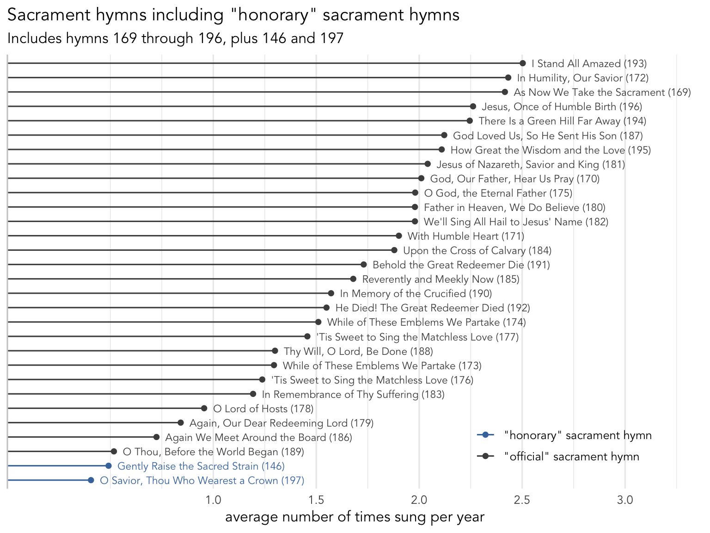

```{r, include = FALSE}
knitr::opts_chunk$set(include = FALSE,
                      echo = FALSE,
                      fig.width = 8,
                      freeze = TRUE)
rmarkdown::render("../../_scripts/analysis_functions.Rmd")
```

```{r}
freqs_1985 <- freqs |> 
    filter(date <= batch1_release_date)
```

I recently updated my very first blog post for this project, which focused on the [sacrament hymns](/posts/sacrament). Since I did that analysis in September 2023, we've been blessed with the addition of many new hymns. At the time of writing (March 2026), we've seen 72 new hymns be released. I thought about adding an analysis of the new hymns as a new section to that original post, but I decided to turn it into a dedicated post. So, here is an analysis of the new sacrament hymns we have seen so far and how their introduction has affected the 1985 sacrament hymns.


## Which new hymns are considered sacrament hymns?

Of the new hymns, about 9 have been tagged as sacrament hymns.^[When looking through the hymns, I'm seeing which ones are tagged with "the Sacrament". (I'm not sure why it's *the* sacrament and not just *sacrament* like all other tags.) I'm getting conflicting results when I search on the website, the Library app, and the now-defunct music app, so I'll just put all of them here.] Here they are:

* `r hymn(1003)`
* `r hymn(1007)`
* `r hymn(1008)`
* `r hymn(1009)`
* `r hymn(1016)`
* `r hymn(1017)`
* `r hymn(1041)`
* `r hymn(1043)`
* `r hymn(1052)`
* `r hymn(1206)`


```{r}
new_sac_hymns <- c(1003, 1007, 1008, 1009, 1016, 1017, 1041, 1043, 1052, 1206)
```

@tbl-new shows how often each of these hymns are sung as opening, sacrament, intermediate, and closing hymns. You'll have to take some of these numbers with a grain of salt, particularly <hymn>`r hymn(1041)`</hymn>, <hymn>`r hymn(1043)`</hymn>, and <hymn>`r hymn(1052)`</hymn> because they are among the newer batches so there has been less time for them to be used. I've put the table in order of the percentage of the time each hymn is sung in the sacrament slot.

```{r}
batch4_hymn_nums
```


```{r, include = TRUE}
#| label: tbl-new
#| tbl-cap: "Frequency of new sacrament hymns"
freqs |> 
    filter(hymn_num > 1000,
           hymn_num < 2000,
           !is.na(type)) |>
    count(hymn_num, name_num, type) |> 
    mutate(prop = n/sum(n), .by = name_num) |> 
    select(-n) |> 
    pivot_wider(names_from = type, values_from = prop, values_fill = 0) |>
    filter(hymn_num %in% new_sac_hymns) |> 
    arrange(-Sacrament) |> 
    mutate(across(Opening:Closing, ~paste0(round(. * 100, 0), "%"))) |>
    select(-hymn_num) |> 
    rename(hymn = name_num) |> 
    gt()
```


To provide some context to these numbers, in my updated [analysis](/posts/sacrament) of the sacrament hymns in the 1985 hymnal, I showed that almost sacrament hymns are sung in the sacrament slot of the meeting 97% of the time or more. The one exception is <hymn>`r hymn(193)`</hymn> which is sung about 9% of the time during other portions of the meeting, which contributes to it being the number one most commonly sung hymn.

For whatever reason though, only three of these hymns have been as consistently sung in the sacrament slot as the 1985 sacrament hymns: <hymn>`r hymn(1007)`</hymn>, <hymn>`r hymn(1043)`</hymn>, and <hymn>`r hymn(1008)`</hymn>. There are two relatively older releases and one newer one, so it doesn't appear to have to do with amount of time they've been out. And I checked across the months and the proportion of time they've been used as sacrament hymns has been pretty steady since their release. (This is true of all the new hymns.) Perhaps it's that the connection to the sacrament is especially transparent in the title and lyrics. 


```{r, fig.height = 12, fig.width = 8}
freqs |> 
    filter(hymn_num > 1000, 
           hymn_num < 2000,
           !is.na(type)) |> 
    count(name_num, hymn_num, type, date) |> 
    pivot_wider(names_from = type, values_from = n, values_fill = 0) |> 
    rowwise() |> 
    mutate(prop_sac = Sacrament/sum(c(Opening, Sacrament, Intermediate, Closing))) |> 
    ungroup() |> 
    filter(hymn_num %in% new_sac_hymns) |> 
    mutate(month = month(date),
           year = year(date)) |> 
    summarize(prop_sac = mean(prop_sac), .by = c(month, year, name_num)) |> 
    mutate(date = my(paste(month, year))) |> 
    ggplot(aes(date, prop_sac)) + 
    geom_point() + 
    facet_wrap(~name_num, scales = "free_x", ncol = 2) + 
    geom_smooth(method = 'loess',
                formula = 'y ~ x',se = FALSE) + 
    scale_y_continuous(limits = c(0, 1),
                       expand = expansion(0, 0.05)) 
```

The other hymns are used a fair amount in other times during the meeting. They include <hymn>`r hymn(1016)`</hymn> and <hymn>`r hymn(1041)`</hymn> which are used as a sacrament hymn most of the time, but a fair amount elsewhere. They also include <hymn>`r hymn(1009)`</hymn> and <hymn>`r hymn(1017)`</hymn>, which were not sung as sacrament hymns the majority of the time. This may be because they existed in Latter-day Saint music culture before their inclusion in the hymnal and it's a hard switch to turn them into sacrament hymns. Perhaps because they're arranged in unison and we don't otherwise have any non-SATB sacrament hymns.^[From the 1985 hymnal, <hymn>`r hymn(193)`</hymn> comes the closest to a unison arrangement with its verse arranged in a duet.] Then there's <hymn>`r hymn(1206)`</hymn>, which might not be sung as a sacrament hymn very often because it's seen more as an Easter hymn. Although the same could be said of <hymn>`r hymn(197)`</hymn>. Finally there's <hymn>`r hymn(1003)`</hymn> which is only marginally on this list anyway and was very rarely sung as a sacrament hymn, so maybe I should take it off the list. 

```{r}
single_hymn_lookup(197)
```

I suspect that the reason why most of these are not as commonly sung during the sacrament slot is simply because of their location among the new hymns. It's easy to remember which are sacrament hymns in the 1985 hymnal because they're arranged all next to each other and in the middle of the printed book. These ones are scattered throughout the new hymns. I suspect that the sacrament hymns in the new printed hymnal will also be placed next to each other, and I predict that these will be more often sung during the sacrament slot and less often in other slots in the meeting. Come back in a few years and maybe I'll do a follow-up analysis!

## How popular have the new sacrament hymns been?

Let's see how popular these new hymns have been compared to the other 1985 hymns. For this portion of the analysis, I'll focus on the data *since* June 2024 when the new ones came out. @fig-freq_all_sacs shows this data. Note that this is the same as Figure 3 in [my previous post on sacrament hymns](/post/sacrament), but with the new hymns overlaid. The hymns labeled "honorary" sacrament hymns are ones outside of the 169--196 range listed in the index, but are nevertheless sung often as sacrament hymns. See [my previous post](/posts/sacrament) for more details. 

For these new hymns, I've adjusted the calculation based on how long they've been out. Specifically, I'm looking at the number of times each hymn has been sung divided by the number of sacrament meetings I have data for since its release date. So, a hymn like <hymn>`r hymn(1008)`</hymn> has been sung a lot, but it's also had many opportunities to be sung in the 21 months since its release. Meanwhile a hymn like <hymn>`r hymn(1043)`</hymn> has only been out for a few months, so while it has only been sung a relatively small number of times, its denominator is smaller because it's only based on a few months of data.

```{r}
new_sac_hymn_no1003 <- c(1007, 1008, 1009, 1016, 1017, 1041, 1043, 1052, 1206)

get_meetings_since_release <- function(.date) {
    freqs |> 
        filter(date >= .date) |> 
        get_n_distinct_meetings()
}

freqs_since_release <- freqs |> 
    filter(date >= batch1_release_date,
           hymn_num %in% c(146, 169:196, 197, new_sac_hymn_no1003)) |> 
    count(name_num, hymn_num) |> 
    mutate(category = case_when(hymn_num %in% 169:196 ~ "canonical",
                                hymn_num %in% c(146, 197) ~ "honorary",
                                hymn_num %in% new_sac_hymn_no1003 ~ "new"),
           release_date = case_when(hymn_num %in% batch1_hymn_nums ~ batch1_release_date,
                                    hymn_num %in% batch2_hymn_nums ~ batch2_release_date,
                                    hymn_num %in% batch3_hymn_nums ~ batch3_release_date,
                                    hymn_num %in% batch4_hymn_nums ~ batch4_release_date,
                                    hymn_num %in% batch5_hymn_nums ~ batch5_release_date,
                                    hymn_num %in% batch6_hymn_nums ~ batch6_release_date,
                                    TRUE ~ batch1_release_date)) |> 
    mutate(meetings_since_release = map_int(release_date, get_meetings_since_release),
           prop_of_meetings = n / meetings_since_release,
           times_per_year = prop_of_meetings * 48) |> 
    arrange(times_per_year) |> 
    mutate(name_num = fct_inorder(name_num))
```


```{r, include = TRUE, fig.height = 6, fig.width = 8}
#| label: fig-freq_all_sacs
#| fig-cap: "Approximate frequency of all sacrament hymns, adjusted for how long they have been out"
ggplot(freqs_since_release, aes(times_per_year, name_num, color = category)) +
    geom_segment(aes(xend = 0, yend = name_num)) + 
    geom_point() + 
    geom_text(aes(label = name_num), hjust = 0, nudge_x = 0.05, size = 3, show.legend = FALSE) + 
    ggthemes::scale_color_ptol() + 
    scale_x_continuous(breaks = seq(0, 2.4, 0.2),
                       minor_breaks = seq(0, 2.4, 0.1),
                       expand = expansion(0, c(0, 0.6))) + 
    scale_y_discrete(breaks = NULL) + 
    labs(title = "Approximate frequency of all sacrament hymns",
         subtitle = "Adjusted for how long they have been out",
         x = "estimated number of times sung per year",
         y = NULL) +
    theme_minimal(base_size = 14, base_family = "Avenir") + 
    theme(legend.position = c(0.9, 0.5)) + 
    theme(axis.text.y = element_blank())
```

```{r}
freqs |> 
    filter(date >= ymd("2024-06-01")) |> 
    cleveland(return = "table") |> 
    mutate(rank = rank(-n, ties.method = "first")) |> 
    filter(hymn_num %in% c("1007", "1008"))
```


The thing to notice here is that the most frequent new sacrament hymns (<hymn>`r hymn(1007)`</hymn> and <hymn>`r hymn(1008)`</hymn>) are sung about as often as a mid-tier sacrament hymn in the 1985 hymnal. That's not to say they're not common---they're still sung about 1.5 times a year on average per ward, or about once every eight months. Those two are currently the 16th and 17th most common hymns since June 2024. 

As for the rest of the new sacrament hymns, they seem to be somewhat less common. These five sacrament hymns are as common as the least common seven sacrament hymns from the 1985 hymnal. Some are less common than even the "honorary" sacrament hymns. 

Again, it hasn't been that long since these came out, so I suspect they'll become more common over time. In fact, as stated already, if when the new hymnal comes out we see that the sacrament hymns are all placed next to each other, I suspect we'll see a spike in the frequency of these hymns, both because it'll be clearer that they are sacrament hymns and because they'll be included in the regular rotation that many wards do as they cycle through the sacrament hymns. 

## How have the 1985 sacrament hymns been affected?

@fig-just1985 is exactly the same as Figure 3 from [my analysis of the 1985 sacrament hymns](/posts/sacrament). This is based on all my data from before June 2024 when the new hymns came out. It offers a snapshot of how frequent each of the sacrament hymns were before we broke the status quo with the release of new hymns.

{#fig-just1985}

When comparing @fig-just1985 (which is based on pre June 2024) data to @fig-freq_all_sacs (which is based on data since June 2024), a keen eye may notice some slight differences. I noticed that <hymn>`r hymn(146)`</hymn> has been more more popular than both <hymn>`r hymn(186)`</hymn> and <hymn>`r hymn(189)`</hymn> over the past 21 months compared to before. But generally, how often a sacrament hymn was sung before the new hymns came out is about as often as they are since. Let's explore whether this is true.

:::{.callout-note}
Fair warning, this section gets a bit technical in the statistical analysis.
:::

```{r}
before_and_after <- freqs_1985 |> 
    cleveland(return = "table") |> 
    mutate(hymn_num = as.numeric(as.character(hymn_num))) |> 
    inner_join(freqs_since_release, by = join_by(hymn_num))
```

```{r}
cor_coef <- round(cor(before_and_after$avg_per_year, before_and_after$times_per_year), 3)
cor.test(before_and_after$avg_per_year, before_and_after$times_per_year)
```


To test this anecdotal claim that how common a hymn was before the new hymns came out compared to after, I ran a Pearson's product-moment correlation test. The correlation is quite high and statistically significant, ($r = `r cor_coef`, p < 0.001$). @fig-cor shows that correlation.

```{r, include = TRUE, fig.height = 5, fig.width = 8}
#| label: fig-cor
#| fig-cap: "How many times per year are sacrament hymns sung?"
ggplot(before_and_after, aes(avg_per_year, times_per_year)) + 
    stat_smooth(method = "lm", formula = "y~x") + 
    geom_text(aes(label = hymn_name), hjust = 0, size = 3, nudge_x = 0.01, alpha = 0.5) + 
    geom_point() + 
    scale_x_continuous(breaks = seq(0, 2.8, 0.2),
                       minor_breaks = NULL,
                       expand = expansion(0, c(0, 0.4))) + 
    scale_y_continuous(breaks = seq(0, 2.4, 0.2)) + 
    labs(title = "How many times per year are sacrament hymns sung?",
         subtitle = "Expressed in mean times per year per ward",
         x = "before June 2024",
         y = "since June 2024") + 
    theme_minimal()
```


That correlation is interesting as it is, but I wanted to see what the difference is between the two time periods. A careful look at the axes in @fig-cor shows that the numbers from before 2024 are slightly lower than the numbers from after June 2024. New hymns are added to the rotation but the number of slots hasn't changed, so they'll all be sung a little less often. @fig-paired shows the same data across time periods but arranged a little differently to show that difference.

```{r}
before_and_after_pivoted <- before_and_after |> 
    select(hymn_num, hymn_name, before = avg_per_year, after = times_per_year) |> 
    pivot_longer(cols = c(before, after), names_to = "era", values_to = "times_per_year") |> 
    mutate(era = fct_rev(era),
           label = paste0(hymn_name, " (", hymn_num, ")"))
```


```{r, include = TRUE, fig.height = 4, fid.width = 8}
#| label: fig-paired
#| fig-cap: "How often sacrament hymns are sung relative to when the new hymns came out"
ggplot(before_and_after_pivoted, aes(era, times_per_year)) + 
    geom_path(aes(group = label)) + 
    geom_point() + 
    geom_text(data = . %>% filter(era == "after"), 
               aes(label = label),
              hjust = 0, nudge_x = 0.01, size = 3, alpha = 0.5) + 
    scale_x_discrete(expand = expansion(0, c(0.5, 1))) + 
    scale_y_continuous(breaks = seq(0, 2.4, 0.2)) + 
    labs(title = "How many times per year are sacrament hymns sung?",
         subtitle = "Expressed in mean times per year per ward",
         x = NULL,
         y = "mean times per year per ward") + 
    theme_minimal()
```


```{r}
paired_t_test <- t.test(before_and_after$avg_per_year, before_and_after$every_x_years, 
                        alternative = "greater", paired = TRUE)
t_value <- round(paired_t_test$statistic, 3)
t_df    <- round(paired_t_test$parameter, 3)
t_p    <- round(paired_t_test$p.value, 3)
```

As you can see all hymns decrease in overall frequency. A one-tailed, paired *t*-test to accompany this plot suggests that the difference between the two groups is statistically significant ($t = `r t_value`$, $df = `r t_df`$, $p < 0.001$). 


```{r}
sac_lm <- lm(times_per_year ~ era, data = before_and_after_pivoted)
summary(sac_lm)
summary(sac_lm)$coefficients
(intercept <- round(summary(sac_lm)$coefficients[1,1], 3))
(after_est <- round(summary(sac_lm)$coefficients[2,1], 3))
(after_p   <- round(summary(sac_lm)$coefficients[2,4], 3))
```

```{r}
(pred_before <- round((1/intercept) * 48, 1))
(pred_after  <- round((1/(intercept + after_est)) * 48, 1))
```


A linear regression on these numbers (modeled as `lm(times_per_year ~ before_vs_after)`) suggests that the estimated number of times each sacrament hymn was sung per ward per year across all sacrament hymns before June 2024 is about `r intercept` (about once every `r pred_before` weeks). This number makes sense since there were about 28--30 to choose from anyway. Since June 2024, the estimated value drops to `r intercept+after_est` times per year, or about once every `r pred_after` weeks, which again makes sense since we have about eight new ones to choose from. According to the linear regression model, shift from before June 2024 to since June 2024 is statistically significant ($p = `r after_p`$).

These numbers match my intuition about what's going on. A ward that has a habit of cycling through all the sacrament hymns, without repeating any before getting through all of them, might find it easiest to just add the new hymns to the rotation. A ward that does that would fit these numbers nearly perfectly. So, while relatively few wards may do that exact thing, it seems like that's what many wards are doing collectively. Some wards are avoiding the new hymns while others are singing them a little more often. In the end, it balances out I think.

### All hymns are equally affected!

What is striking to me is that there isn't a systematic pattern to the lines in @fig-paired. By that, I mean that there isn't a cluster of hymns that have a much steeper or shallower slope than the others. Given the starting point on the left of the plot, you can reasonably guess where the end point of the line will be bsed on the average difference between all of the hymns.

This is in contrast to how the 1985 Christmas hymns were affected. In [a recent analysis](/posts/christmas2025), I compared the 2025 Christmas season to 2023 and before. I found that the most popular Christmas hymns were sung about as often in 2025 as they were in 2023. Meanwhile the least popular ones were sung less often. The new Christmas hymns were introduced at the expense of the least popular hymns. If it were the case that sacrament hymns were affected in a simplar way, we'd see steeper lines at the bottom of the plot and more flat lines at the top. But we don't see that here. 

I can think of three reasons for this systematic effect. 

1. Many wards cycle through the sacrament hymns. They don't repeat one until they've gotten through all of them. If a new hymn is added to that cycle, then all old hymns would be equally affected. 
1. I don't think people have favorite sacrament hymns like they do Christmas hymns. People have favorite Christmas hymns. Perhaps the Christmas season doesn't feel complete without singing it. Music coordinators may ensure that those are included each year. But for the less familiar ones, people don't mind if they miss a year or two, so those are the ones that get skipped to make room for the new ones. But I don't think people feel quite so strongly about the sacrament hymns, so if we go for another few weeks without singing <hymn>`r hymn(193)`</hymn>, people won't mind.
1. Finally, a big difference between the Christmas season and sacrament hymns is that there is only a certain number of weeks when Christmas hymns can be sung without raising eyebrows. So, in 2025 there were just as many slots as there was in 2023, but more Christmas hymns to choose from. Some have to take a hit because you just can't get through all of them. That's not the case with sacrament hymns. So peps this unbounded nature of the sacrament hymns is part of the reason why they've been affected more evenly. 

## Conclusion

This post analyzes the sacrament hymns introduced since June 2024 and how their inclusion in church has affected how often the sacramnet in the 1985 hymnal have been sung. I found that the most common sacrament hymns are <hymn>`r hymn(1007)`</hymn> and <hymn>`r hymn(1008)`</hymn>, which are also almost exclusively sung during the sacrament slot of the meeting. They're sung about as often as many other 1985 sacrament hymns. Most other new sacrament hymns are sung a fair amount, but are often found in other parts of the meeting as well. All 1985 sacrament hymns are sung a little less often than they used to be and they all seem to have been affected about the same. 

I think we're in an interesting transition phase with sacrament hymns. Once the new hymnal comes out, I think we'll see a focusing process happen. There will be a clearer line drawn between hymns appropriate for the sacrament slot of the meeting and other hymns. I suspect then that we'll see some o the less common ones now jump to be more common. It'll be fun to see how these numbers chnage over the next few years. 